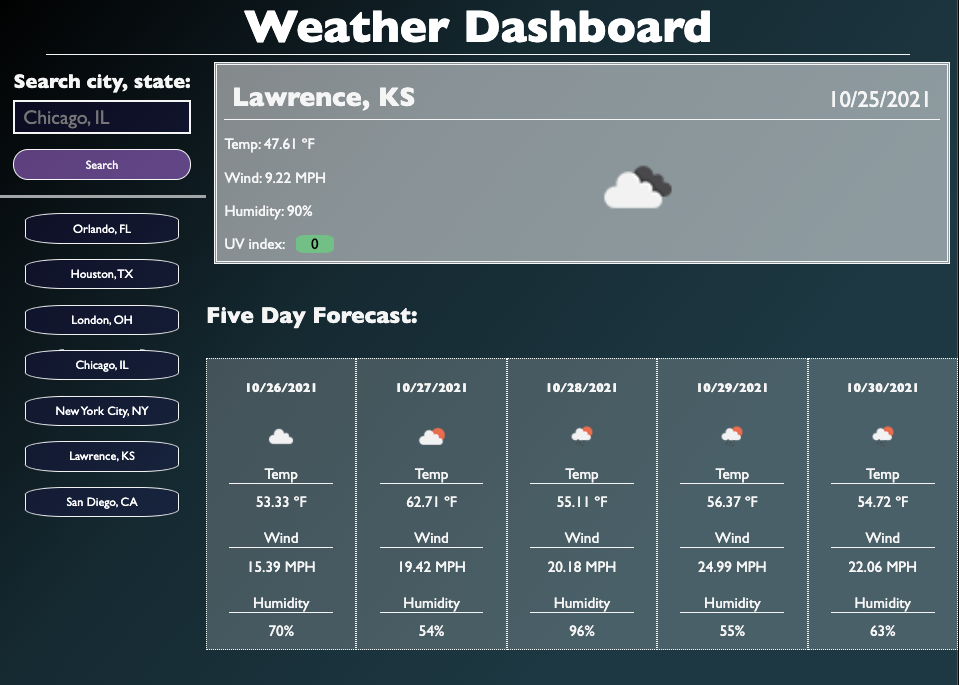

# Weather Dashboard

Deployed App: [Weather Dashboard](https://highdynamics.github.io/weather-dashboard)

## Features
- Uses openweather api to get current weather
- Displays current weather and a 5-day forecast
  - Temperature, wind speed, humidity and UV index (UV index for current day only)
- Searches displayed as buttons and persisted to local storage
- Optimized for mobile
- Searches within the United States are available